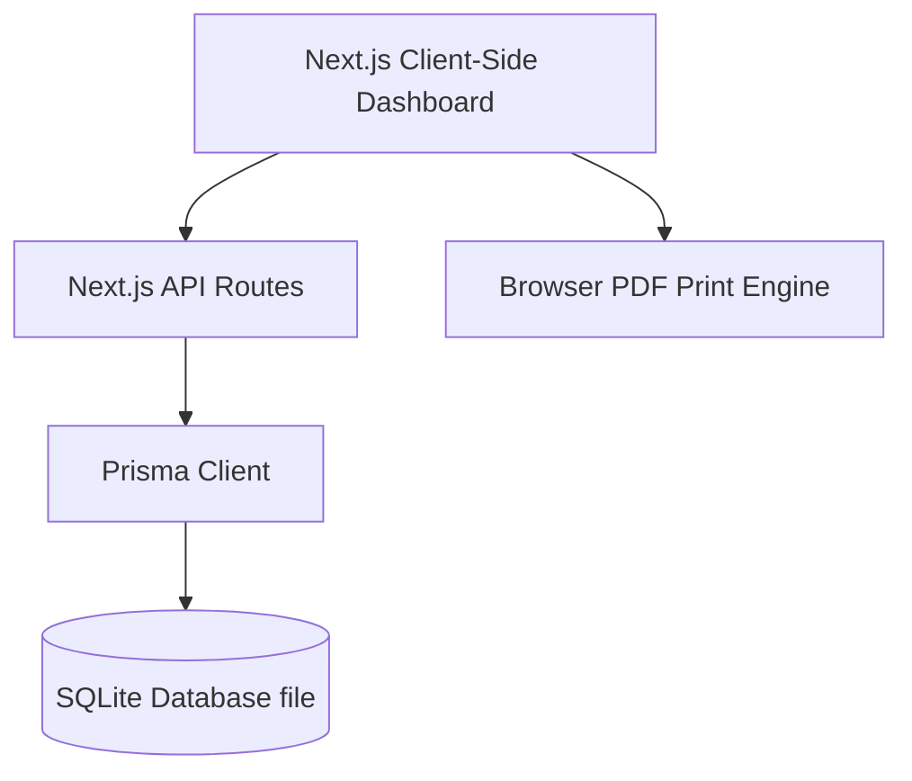

# Implementation Plan - Quarterly Asset & Liability Snapshot

This document details the plan to build a beautiful, modern, full-stack web application to track family investments and liabilities, generate quarterly snapshot reports, and visualize financial health over time.

---

## User Review Required

> [!IMPORTANT]
> **Node.js Dependency**: Since Node.js is not currently installed in your environment but Homebrew is available, we propose to automatically install the latest LTS version of Node.js using Homebrew (`brew install node`) to enable a modern Next.js/React full-stack application.
> *Please confirm if you are comfortable with us installing Node.js.*

> [!TIP]
> **Stack Recommendation**: We strongly recommend using **Next.js (React) + SQLite (via Prisma ORM) + CSS Modules**. This setup is:
> - **Self-contained**: All code, frontend, API backend, and SQLite database reside inside `/Users/vicky/Projects/QtrlyAssetLiabilitySnapshot`. No external database server to run or maintain.
> - **Multi-tenant ready**: The database schema is fully relational and incorporates a `user_id` on all core tables, making it trivial to scale to a cloud PostgreSQL database and enable multiple users in the future.
> - **High Performance**: Modern React rendering and static optimization for quick updates.

---

## Open Questions

> [!WARNING]
> **User Authentication**: For the initial local version, do you want a simple login screen to start modeling the multi-tenant experience, or should we default to a single-user dashboard that is directly accessible and bypasses authentication for convenience?
> *We recommend starting with a simple, clean login page that seeds a default user (e.g., John & Jane) so that the multi-tenant database structure is fully exercised from day one.*

---

## Proposed Changes

We will create a standard, professional full-stack project structure in `/Users/vicky/Projects/QtrlyAssetLiabilitySnapshot` using Next.js.

### Component: Database & Models

We will configure Prisma ORM with SQLite. This provides high-quality type safety and simple migrations.

#### [NEW] [schema.prisma](file:///Users/vicky/Projects/QtrlyAssetLiabilitySnapshot/prisma/schema.prisma)
Defines the database schema:
- `User`: Multi-tenant user record.
- `Quarter`: Stores snapshot metadata (e.g., `2025-Q4`, snapshot date `2026-01-26`).
- `AccountCategory`: Custom investment classes (e.g., `TFSA`, `RRSP`, `RESP`, `General`).
- `Institution`: Dynamic institutions (e.g., `TD`, `RBC`, `SunLife`, `Manulife`).
- `Owner`: Owners of assets (e.g., `John`, `Jane`, `Family`, `Kids`).
- `Account`: Dynamic accounts mapping category, institution, and owner.
- `AccountBalance`: Captures the balance for an account in a specific quarter.
- `CustomAssetLiability`: Dynamic non-standard entries (e.g., house equity, mortgages, HELOCs).

### Component: Backend APIs

We will create API routes under `app/api` to handle CRUD operations.

#### [NEW] API Routes
- `/api/auth`: Custom session or token-less mock login for local development.
- `/api/quarters`: Fetch, create, and update quarterly snapshots.
- `/api/accounts`: Manage dynamic accounts, institutions, owners, and categories.
- `/api/dashboard`: Calculate net worth, asset/liability ratio, and chronological trend metrics for charts.

### Component: Frontend UI

The user interface will be built using **React** and **CSS Modules** for premium styling, including a stunning **Dark Mode / Glassmorphism** design theme with high-performance charts using a lightweight, premium library like Chart.js or Recharts.

#### [NEW] [Dashboard View](file:///Users/vicky/Projects/QtrlyAssetLiabilitySnapshot/app/dashboard/page.tsx)
- Financial Health Overview: High-level metrics cards with elegant animations.
- Chronological Trends: Interactive graphs charting Net Worth, Assets, and Liabilities over time.

#### [NEW] [Snapshot View & Editor](file:///Users/vicky/Projects/QtrlyAssetLiabilitySnapshot/app/snapshots/[quarterId]/page.tsx)
- **View Mode**: Displays the exact matrix of tables from your Excel sheet (Investment Summary, Institution Summary, TFSA, RRSP, RESP, General breakdowns, and the Asset/Liability Net Worth panel) in a high-fidelity, polished dashboard.
- **Edit Mode**: Switches the grid into a form where users can update all balances for the selected quarter, with inline validation and "auto-carry" from the previous quarter.
- **PDF Export**: A print-optimized layout utilizing CSS `@media print` rules, allowing the user to print or save a beautiful, clean PDF of the quarterly snapshot directly.

---

## Verification Plan

### Automated Tests
1. Run automated build script to verify React compilation: `npm run build`.
2. Seed the database with mock data matching the exact numbers in the attached spreadsheet and verify that aggregates match perfectly:
   - Total Assets: `$31,200.00`
   - Total Liabilities: `-$50,000.00`
   - Net Worth: `-$18,800.00`

### Manual Verification
1. Launch the local dev server (`npm run dev`).
2. Populate the 2025-Q4 data and compare the rendering side-by-side with your Excel spreadsheet image.
3. Open the Print dialog (`Cmd + P`) and verify that the print layout reformats the grid into a gorgeous, header-free PDF report.
4. Add a new quarter (e.g., `2026-Q1`), enter updated values, and confirm that the dashboard charts successfully plot the financial progress trend.
